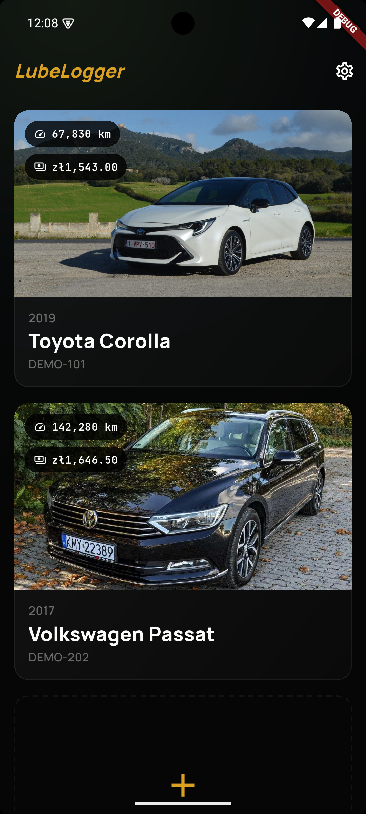
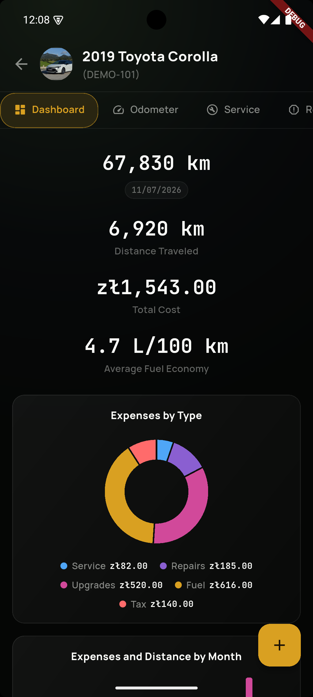
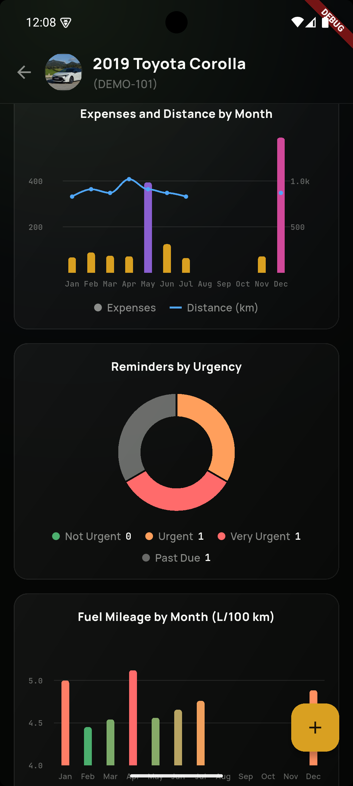
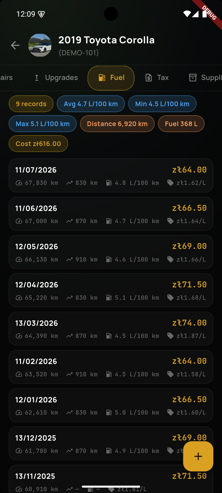

# LubeLogger mobile

A native Android companion for your self-hosted **[LubeLogger](https://lubelogger.com)**
server — log fuel, track service and repairs, and stay on top of maintenance
reminders for every vehicle, right from your phone.

> **Requires your own LubeLogger server.** This is a companion app: it talks only
> to the LubeLogger instance you point it at, using an API key you generate. It has
> no cloud service of its own. It is unofficial and not affiliated with, endorsed by,
> or connected to LubeLogger or Hargata Softworks.

## Screenshots

<p align="center">
  
  
  
  
</p>

More in [docs/store-assets/screenshots](docs/store-assets/screenshots) (phone, 7"/10" tablet).

## Features

- **Your whole garage** — add, edit and remove vehicles, see their photos, and open
  a dedicated screen for each with distance in km, miles or engine hours.
- **Fuel & mileage** — log fill-ups and odometer readings and track fuel economy
  (average, min, max, distance, cost). Add a fuel or odometer entry straight from a
  home-screen shortcut.
- **Complete history** — service, repairs, upgrades, tax, supplies, the planner and
  notes: every record type LubeLogger supports, all fully editable.
- **Reminders** — LubeLogger's reminders plus optional background notifications when
  something is due or overdue.
- **Dashboard & charts** — a per-vehicle overview with fuel-economy trends, mileage
  by month, reminders by urgency and cost summaries.
- **Made to fit you** — attach receipts and documents to records, show/hide and
  reorder the record tabs, switch between metric and imperial units, responsive
  phone/tablet layouts, and a light or dark theme.

## Distribution

- **GitHub Releases** (for [Obtainium](https://github.com/ImranR98/Obtainium)) —
  [repository releases](https://github.com/DoYouHost/lubelogger-mobile/releases)
- **Project page:** https://doyouhost.github.io/lubelogger-mobile/
- **Privacy policy:** https://doyouhost.github.io/lubelogger-mobile/privacy.html
  ([source](site/privacy.html))

## Demo mode

Point the app at the magic `demo` server to explore with sample vehicles and records,
fully offline — no LubeLogger server required.

| Field         | Value          |
| ------------- | -------------- |
| Server address | `demo`        |
| API key        | `demodemodemo` |

## Authentication

The app authenticates with a LubeLogger **API key** sent as the `x-api-key` header —
there is no username/password or Basic auth. Generate a key in LubeLogger under
its **Settings**; a non-expiring, scoped key is recommended.

## Server compatibility

Built and tested against the LubeLogger REST API. Some
endpoints require newer servers (e.g. deleting a vehicle needs LubeLogger 1.7.0+).
Parsing is defensive — unknown fields are ignored and missing ones don't crash the app.

## Privacy

LubeLogger mobile has **no analytics, no advertising and no cloud service.** Your API
key is stored in encrypted, Android Keystore-backed storage (`flutter_secure_storage`)
and is only ever sent to the server you configure.

## Build

Requires [Flutter](https://docs.flutter.dev/get-started/install) (stable) and the
Android SDK.

```sh
flutter pub get
flutter run                  # on a connected device or emulator
```

Release builds and GitHub releases go through [`just`](https://github.com/casey/just)
(see [justfile](justfile)):

```sh
just build            # release APK       -> build/dist/
just build-aab        # Play Store bundle -> build/dist/
just ship X.Y.Z       # full pipeline: bump + test + build + GitHub release
just ship-dev         # prerelease of the current commit, for Obtainium testers
```

Tests and lint:

```sh
flutter analyze
flutter test
```

## License

[AGPL-3.0](LICENSE). "LubeLogger" is a project of Hargata Softworks; LubeLogger mobile
is an independent, community-built companion app and is not affiliated with or endorsed
by the LubeLogger project.
